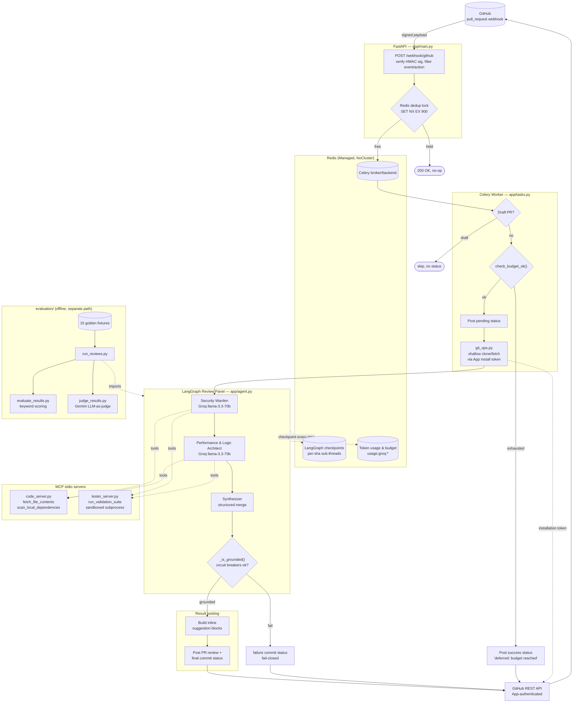

# PR Review Agent

An automated GitHub PR reviewer powered by a **multi-agent LLM panel**. It listens for pull request webhooks, statically reviews only the changed files with a team of specialized AI agents, and posts the result back to GitHub as a real PR review — with concrete fixes rendered as clickable, one-click `suggestion` blocks.

Built around two constraints that matter in production, not just in a demo: a **tight LLM API budget** (Groq free tier) and the fact that this pipeline **executes untrusted, PR-supplied code** to run the target repo's own test suite.

## Evaluation results

Measured against a 15-fixture golden dataset of deliberately injected bugs (SQL injection, race conditions, off-by-one errors, etc.), graded by an independent LLM judge:

| Category | Recall |
|---|---|
| Security | 5/5 (100%) |
| Performance | 5/5 (100%) |
| Structural | 5/5 (100%) |
| **Overall** | **15/15 (100%)** |

- **Precision:** ~71% (6 false positives across 15 fixtures)
- **F2 score** (recall weighted 4x over precision — a missed vulnerability costs more than a false positive): **≈0.93**

See [`evaluation/`](evaluation/) for the full harness and methodology.

## Key features

- **Multi-agent review panel, not a single generic prompt.** A Security Warden (OWASP, injection, dependency vulns, data leaks) and a Performance & Logic Architect (algorithmic complexity, correctness, silent failure modes like races and off-by-ones) each independently review the diff within their own scope, then a Synthesizer merges both into one structured, deduplicated report.
- **Scoped, read-only tool access via MCP.** Each specialist can only read the PR's changed files (plus their local dependencies) — never list or browse the whole repository — and can run the PR's actual test suite to verify claims before asserting them.
- **Actionable output, not just prose.** Concrete fixes are rendered as GitHub's native inline `suggestion` blocks, applicable with one click, anchored to exact file/line via a grounding check that discards any suggestion referencing a file the panel never actually read.
- **Fail-closed correctness guardrails.** A review is only posted if its content is grounded in files the panel actually fetched and neither specialist's tool-call loop tripped a circuit breaker — otherwise the pipeline posts a `failure` status rather than a degraded/hallucinated review.
- **Hardened against its two real operational risks:**
  - *Budget exhaustion* — every Groq call's token usage and cost is recorded to Redis; a daily budget gate skips new reviews (with a neutral, non-blocking commit status) once the shared quota is close to exhausted.
  - *Untrusted code execution* — the MCP server that runs a PR's test suite executes it with a stripped environment (no secrets in scope) and dropped privileges where the OS allows it, specifically to stop a malicious PR from exfiltrating secrets through captured stdout/stderr into the LLM's context.
- **Crash-safe.** Every specialist's ReAct loop and the panel graph itself are checkpointed to Redis (via LangGraph), so a worker crash mid-review resumes cleanly instead of restarting from scratch and re-burning tokens.
- **Idempotent webhook handling.** GitHub redeliveries of the same commit are deduplicated via a Redis lock before any Groq call is made.

## Architecture



### Request flow

1. GitHub sends a `pull_request` webhook to `POST /webhook/github`. The raw body is HMAC-SHA256 verified against a shared secret; only `opened`/`synchronize` actions proceed (GitHub fires this event for many non-code-change actions too).
2. A Redis lock (`SET NX EX 900`) deduplicates redeliveries — a GitHub retry for a commit already queued is a no-op, not a second review.
3. The request is queued to Celery and the webhook returns `202` immediately; nothing blocks on the actual analysis.
4. The Celery worker skips draft PRs, checks the shared daily Groq token budget, posts a `pending` commit status, and shallow-clones the PR branch using a fresh GitHub App installation token.
5. The LangGraph review panel runs: **Security Warden → Performance & Logic Architect → Synthesizer** (sequential, to stay under Groq's per-minute rate limit). Each specialist is a ReAct agent restricted to read-only MCP tools scoped to the PR's changed files.
6. The Synthesizer merges both reports into one structured `ReviewOutput`, resolving overlap and routing findings into the correct section.
7. A grounding check verifies every claim references a file the panel actually read; if it fails (or either specialist's tool loop errored out repeatedly), the pipeline fails closed and posts a `failure` status instead of a degraded review.
8. On success, inline `suggestion` comments and a full PR review are posted back to GitHub, followed by a final commit status.

### Project layout

```
app/            FastAPI webhook receiver + Celery worker + LangGraph review agent
mcp_servers/    Standalone stdio MCP servers exposing repo actions to the agent
evaluation/     Golden dataset + scripts for measuring review-panel quality
docker/         Container entrypoint scripts for Azure Container Apps deployment
tests/          Fast, fully-mocked test suite (pytest)
```

## Tech stack

- **API / worker:** FastAPI, Celery, Redis (broker, checkpointer, and telemetry store)
- **Agent orchestration:** LangGraph (`StateGraph`), LangChain
- **LLM:** Groq (`llama-3.3-70b-versatile`), Gemini (`gemini-3.5-flash`, evaluation judge only)
- **Tool protocol:** MCP (Model Context Protocol), stdio transport
- **GitHub integration:** PyGithub, GitHub App authentication (short-lived installation tokens, not a static PAT)
- **Deployment:** Docker, Azure Container Apps, Azure Managed Redis (Enterprise), ACR, GitHub Actions (OIDC-authenticated)

## Getting started

### Prerequisites

- Python 3.11+
- Redis reachable locally (Redis 8+ recommended — the LangGraph checkpointer needs RediSearch/RedisJSON modules)
- A Groq API key
- A GitHub App (for webhook delivery + installation-token auth) — App ID and base64-encoded private key

### Setup

```bash
python -m venv .venv
source .venv/Scripts/activate        # Windows Git Bash; use .venv\Scripts\Activate.ps1 in PowerShell
pip install -r requirements.txt
cp .env.example .env                 # then fill in real values
```

`.env` requires `GITHUB_WEBHOOK_SECRET`, `GROQ_API_KEY`, `GITHUB_APP_ID`, and `GITHUB_APP_PRIVATE_KEY_B64` — these have no defaults, and every entry point (`app.main`, `app.worker`, `app.tasks`) fails to import without them. Generate the private-key value with `base64 -w0 your-app-private-key.pem`.

### Run it

```bash
# API server
uvicorn app.main:app --port 8000

# Celery worker (requires Redis) -- -P solo is required on Windows
celery -A app.worker.celery_app worker --loglevel=info -P solo
```

### Send it a real PR to review

```bash
# Fire a signed mock webhook against a real PR, without needing a live GitHub webhook
python simulate_pr.py --pr-number <n> [--full-name owner/repo]

# Or forward real GitHub webhook events via the gh CLI extension
gh webhook forward --repo=<owner/repo> --events=pull_request \
  --url="http://localhost:8000/webhook/github" --secret="<value matching GITHUB_WEBHOOK_SECRET>"
```

### Test

```bash
pytest tests/ -v                                        # fast, fully mocked -- no live Redis/Groq/GitHub calls

pytest tests/test_integration.py -m integration -v       # real Groq + Redis + MCP subprocesses -- costs real tokens
```

### Run the evaluation harness

```bash
python evaluation/run_reviews.py          # runs the panel against all 15 golden fixtures
python evaluation/evaluate_results.py     # offline keyword-based recall scoring
python evaluation/judge_results.py        # LLM-as-judge pass (Gemini) -- Precision/Recall/F2
```

## Required GitHub App permissions

- **Contents: Read** — git clone/fetch
- **Pull requests: Read & write** — posting reviews, listing changed files
- **Commit statuses: Read & write** — pending/success/failure status checks

## Deployment

Deployed on **Azure Container Apps** — the FastAPI web app and Celery worker run as separate Container Apps sharing one image, backed by Azure Managed Redis (Enterprise, `NoCluster` policy) and ACR. CI/CD is a GitHub Actions workflow (`.github/workflows/deploy-azure.yml`) authenticated to Azure via OIDC (no stored cloud credentials), triggered on changes to `app/`, `mcp_servers/`, `docker/`, or the Dockerfile.

## Security notes

- The MCP server that runs a PR's test suite executes it in a **sandboxed subprocess**: a stripped, allowlisted environment (no API keys or secrets reachable via `os.environ`) and dropped privileges where the OS supports it — pytest collection runs arbitrary module-level code from the PR itself, so this is treated as untrusted code execution, not just test running.
- All file-path tools resolve and validate paths stay within the checked-out repo root, since file paths ultimately originate from LLM output or PR content.
- Review specialists are read-only — no agent has a code-patch tool — so a suggested fix is always surfaced as a proposal for a human to accept via GitHub's UI, never applied automatically.
- GitHub auth uses short-lived, per-installation App tokens rather than a long-lived personal access token.
